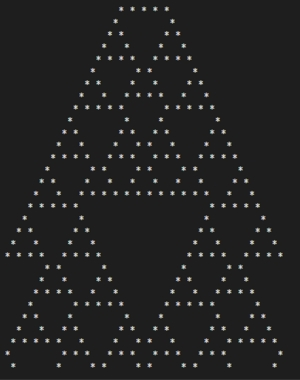
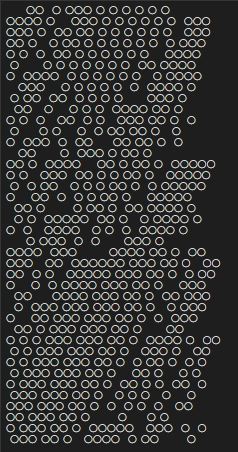

### [General Wiki description](https://en.wikipedia.org/wiki/Cellular_automaton)  
One-dimensional cellular automaton (CA) consists of a row of "cells," 
where each cell can be in one of several "states," plus a set of "rules" for changing those states. 
The cells can be visualized as squares, where the state of the cell corresponds to the color of the square. 
There is only a finite number of possible states.

### [Simplest 1D CA explained](https://mathematica.stackexchange.com/questions/229207/how-to-write-a-function-from-scratch-to-simulate-a-cellular-automaton)

### Code explained
**Input:**  
- *Size* (width) of the world: Integer > 0
- *Number of iterations* ("height"): Integer >= 0
- *Initial string*: String contained only \`1\` and \`0\` (no cleaning inside code)  
  Length > 0  
If Length > Size, take first Size items; if Length < Size, String expand by zeroes.  
- [Wolfram code](https://en.wikipedia.org/wiki/Wolfram_code) of 1D 3-CA: 0 < Integer < 256  
- *Кeplacement symbols:* List for \`0\` and \`1\` replacement in Output. 
   E.g. ⟨ \` \` | \`■\`⟩   
 
**Output:**  
- Width * Height Unicode strings showing evolution of the world (initial string on top)  

### Examples
Code: 30, Width: 50, Height: 20, Initial: \`1\`, Symbols: ⟨ \` \` | \`■\`⟩:   

Code: 73, Width: 50, Height: 16, Initial: \`1\`, Symbols: ⟨ \` ▢ \` | \`▦\`⟩:  

Code: 169, Width: 30, Height: 40, Initial: \`0110010111010101010101\`, Symbols: ⟨ \`◯ \` | \` \`⟩:  

